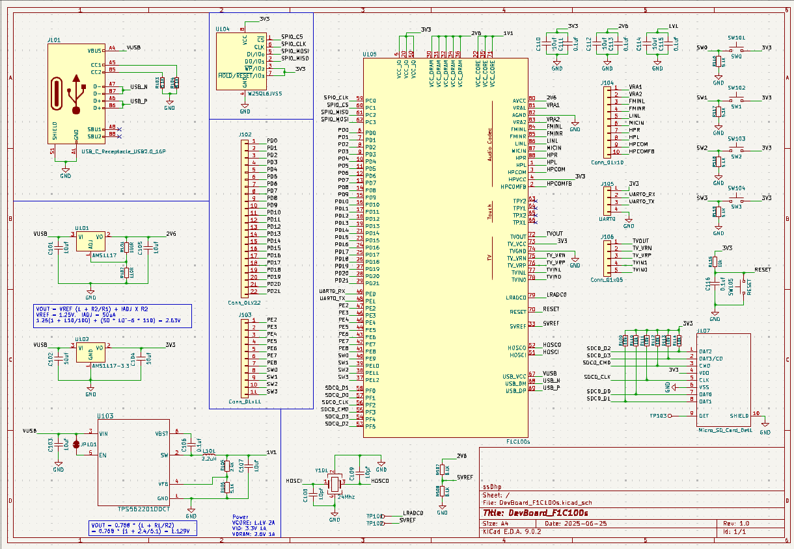
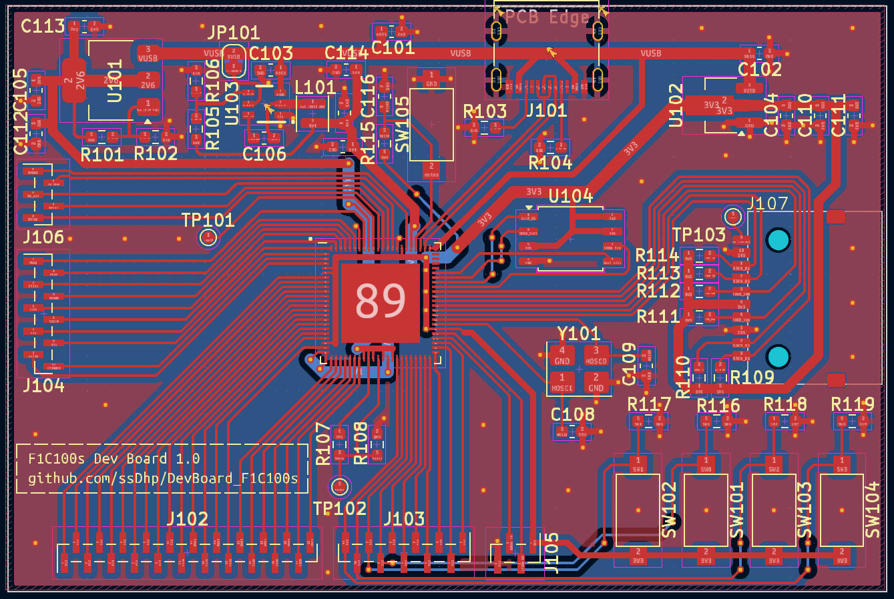
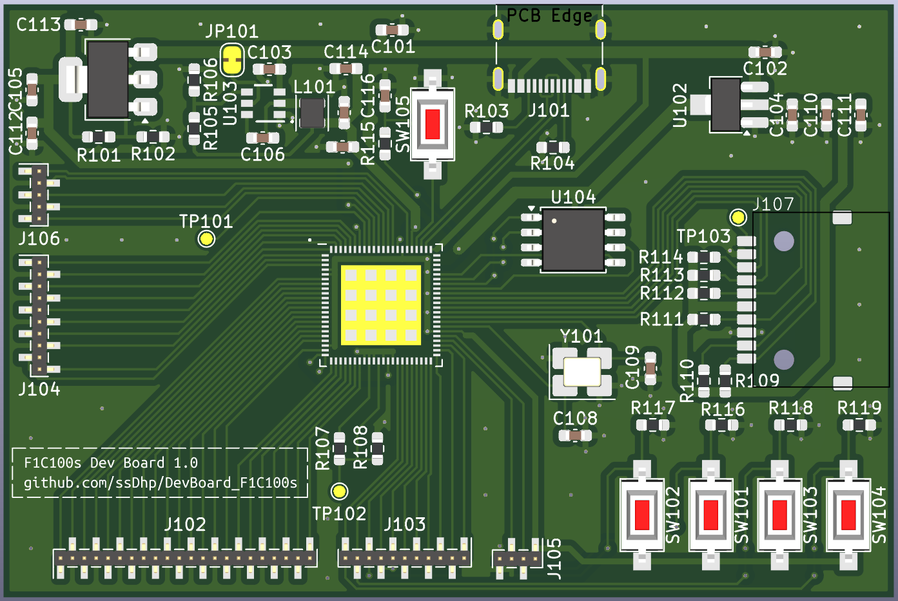

# DevBoard_F1C100s Rev1
F1C100s based Linux development board

## Note
I couldn't get this revision of the board to enumerate over USB. 
Even after fixing multiple issues on the board.
Issues:
- Wrong footprint for USB Type-C connector
- Wrong voltage on UVCC pin of F1C100s
- Missing pull-up on CS pin of Flash

## Schematic

## Layout
2 Layers 75x50 mm  

## Render
