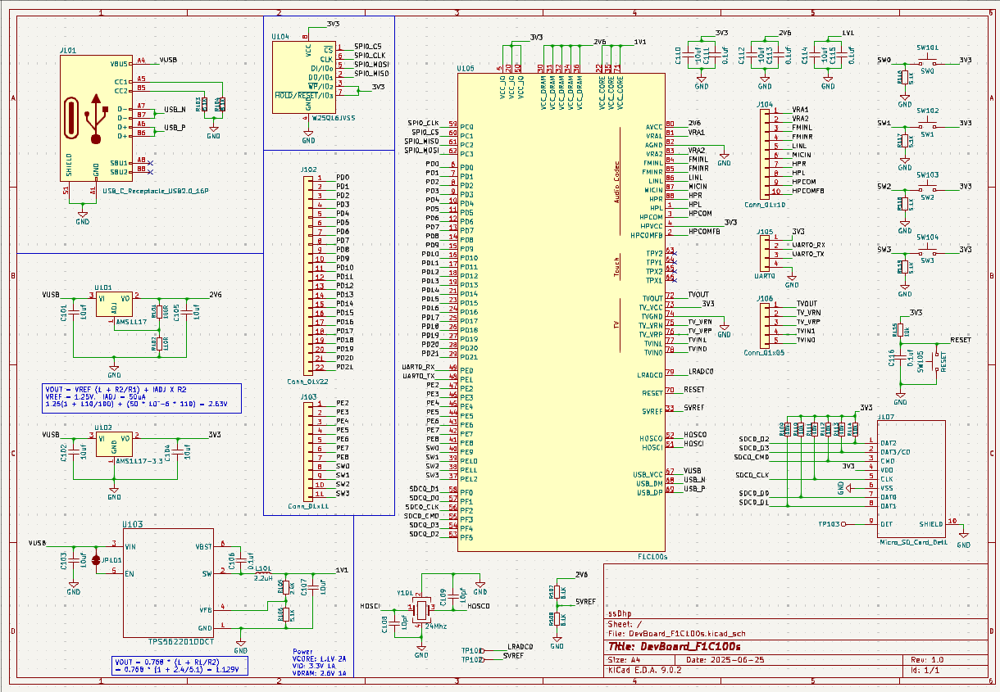
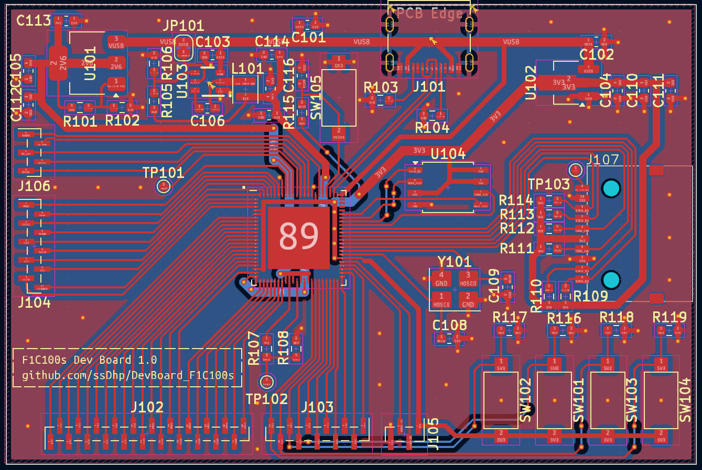
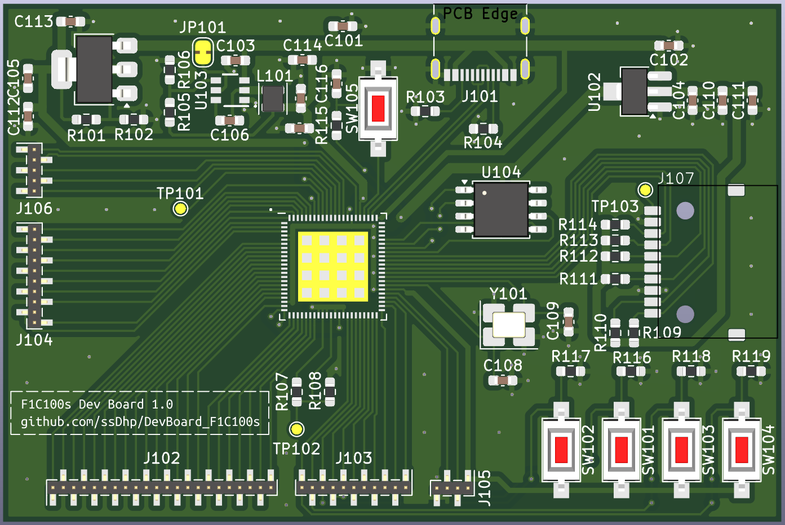
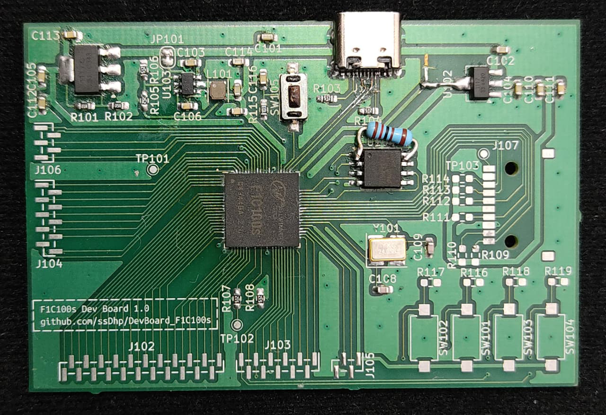
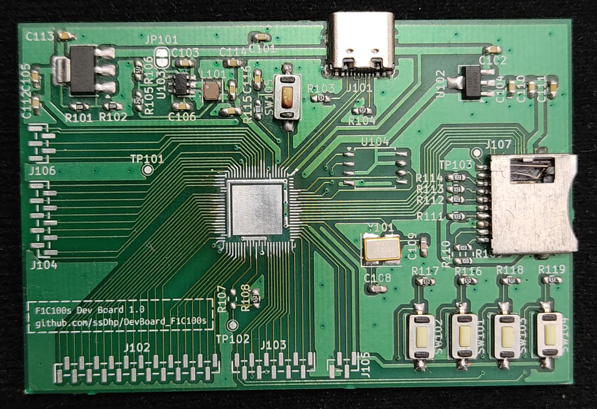
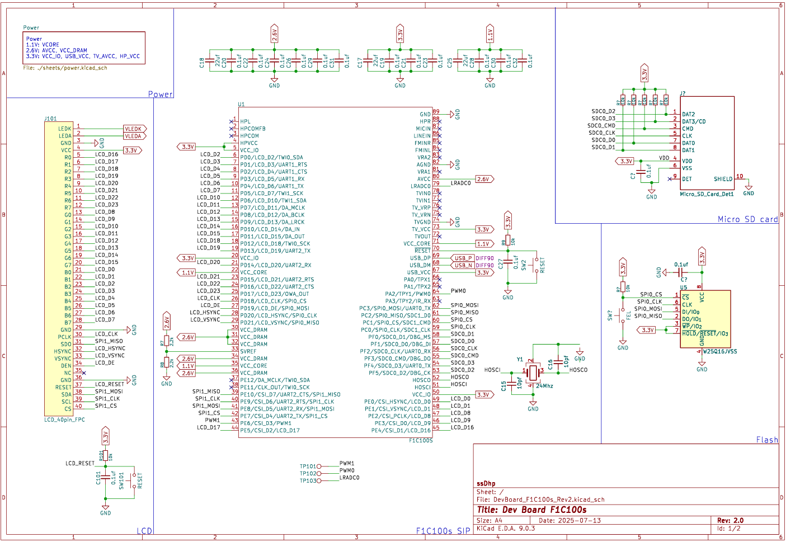

# DevBoard_F1C100s Rev 1
F1C100s based embedded Linux development board

## Schematic

## Layout
2 Layers 75x50 mm  

## Render

## Assembled PCB

## Note
- Board enumerates over USB but randomly resets likely due to missing bulk capacitor on VBUS.
- Other issues:
    - Wrong voltage on UVCC pin of F1C100s
    - Missing pull-up on CS pin of Flash

# DevBoard_F1C100s Rev2

## Schematic

## Layout
4 Layers 60x45mm

## Render

## Note
 - **TODO:** Assemble and Test rev 2 of the dev board.
